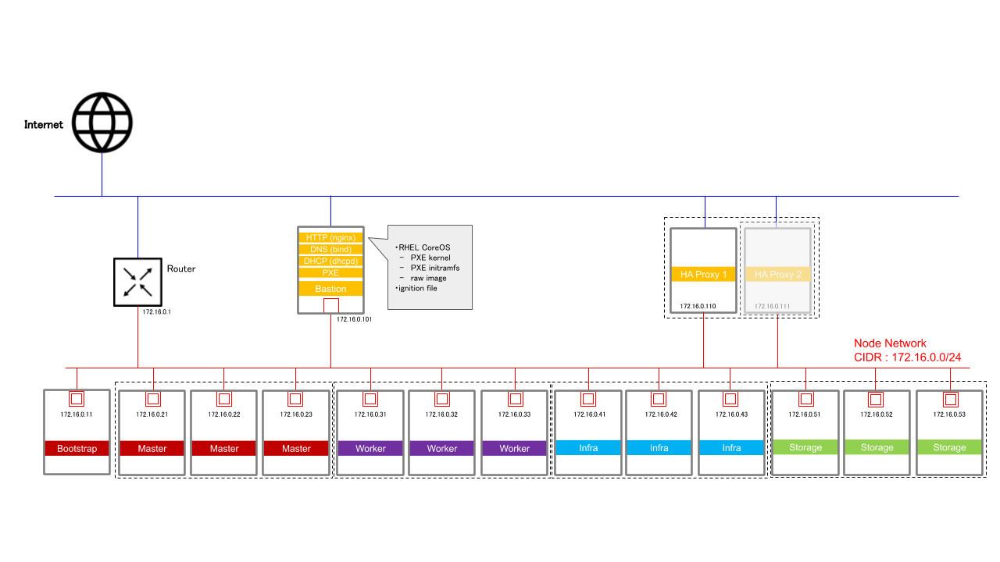

# 3章 : OpenShift Container Platform 4 Baremetal UPI の設計

本章はOpenShift Container Platform 4のクラスタをBaremetalでインストールするための設計について説明する。

本ドキュメントでは下図のようなOpenShiftクラスタを例とし、この構成を構築するための設計と手順を紹介する。

---
## 3.1. OpenShiftノード構成

 

### 3.1.1. ノード一覧
| ノード | 台数 | x86_64 CPU   (thread/vcpu) 1 | メモリ搭載量 | システムドライブ 2 | 追加ドライブ 3| 10G NIC   (Ports) 4 | 備考 |
|:--------:|:--------:|:-----------------:|:----------------:|:----------------:|:------------:|:------------:|:-----------------:|:-----------------:|:-----------------|
| Master   | 3 | 8  | 32 GB | 120 GiB | -            | 1 |
| Worker   | 3 | 8  | 32 GB | 120 GiB | -            | 1 |
| Infra    | 3 | 8  | 32 GB | 120 GiB | -            | 1 |
| Storage  | 3 | 16 | 48 GB | 120 GiB | 1 TiB SSD x3 | 1 | 合計 3 TiB の Persistent Storage
| Bootstrap| 1 | 4  | 16 GB | 120 GiB | -            | 1 | クラスターが構築できたら 認証サーバ等別の役割に切り替える

 

&emsp; *1 : SMTを有効とする物理サーバー、または仮想サーバーを使う場合は、1 core = 2 threads = 2 vcpus で換算。  
&emsp; *2 : 必要に応じて適宜2ドライブでRAID 1を構成するなどして冗長化する。  
&emsp; *3 : Persistent Storageとして必要となる容量を搭載する。詳細は下記サイジングのヒントを参照。  
&emsp; *4 : 必要に応じて適宜Bondingなどで冗長化、帯域幅の拡張を行う。BMC用は必要に応じて適宜用意する。  

 
 

- OpenShift クラスターは、Master Node と Worker Node で構成される。
- オプションで Infrastructure Node(Infra Node) と Storage Node(OCS) ノードも加えることで、よりOpenShiftの使用に適したクラスターになるため、本構成にはこれらも含めて構築する。 
Infra Node と Storage Node は、最初 Worker Node として立ち上げ、クラスター構築後にラベルを貼ることでそれぞれの役割となる。
- また、クラスター構築時に Master Node を起動するための Bootstrap Node が一時的に必要となる。 
Master Node が立ち上がれば Bootstrap Node は不要となるので、別の役割のサーバーとして切り替える事ができる。

 

### 3.1.2. 各ノードのサイジング
#### Master Node
- Master Nodeは **3台** が必要
- [Master Nodeの最小リソース要件](https://access.redhat.com/documentation/ja-jp/openshift_container_platform/4.5/html/installing_on_bare_metal/installing-on-bare-metal#installation-requirements-user-infra_installing-bare-metal)
- [Master Nodeの推奨スペック](https://access.redhat.com/documentation/ja-jp/openshift_container_platform/4.5/html/scalability_and_performance/master-node-sizing_)  
管理対象のWorker Nodeの数で変わる。
Master Nodeはスケールアウトしたり、CPUやRAMのサイズを変更することができないため、あらかじめクラスターに配備するWorker Nodeの最大数を想定してスペックを決める。  

#### Worker Node
- Worker Nodeは **2台以上** が必要  
本構成では3つのFailure Domainで分散するため3台とする。
- [Worker Nodeの最小リソース要件](https://access.redhat.com/documentation/ja-jp/openshift_container_platform/4.5/html/installing_on_bare_metal/installing-on-bare-metal#installation-requirements-user-infra_installing-bare-metal)
- Worker Nodeの推奨スペック  
実際にはWorker Nodeで稼働するアプリケーションPodが求めるリソースに依存するので、一概に推奨スペックは言えない。  
あらかじめ稼働するアプリケーションが全て分かっている場合は必要なリソースが計算できるが、分からない場合は暫定的にスペックを決めスケールアウトする方針がよい。

#### Infra Node
- Infra Nodeは **3台以上** が必要  
本構成では3台で構成する。
- Infra Nodeの最小リソース要件はWorker Nodeに則するが、最小要件ではリソース不足でクラスターサービスが稼働しない恐れがある。
推奨スペックのリソースを用意すること。
- [Infra Nodeの推奨スペック](https://access.redhat.com/documentation/ja-jp/openshift_container_platform/4.5/html/scalability_and_performance/infrastructure-node-sizing_) 
管理対象のWorker Nodeの数で変わる。

#### Storage Node (OCS Node)
- Storage Nodeは **3台以上** が必要  
本構成では3台で構成する。
- [Storage Nodeの最小リソース要件](https://access.redhat.com/documentation/en-us/red_hat_openshift_container_storage/4.5/html-single/planning_your_deployment/index#resource-requirements_rhocs) 
ドライブが増えるごとに追加でリソースが必要になることに注意。
- 4 TiB以下のSSDをドライブとして使用できる。
- OpenShift Container Storageでは、3 Nodeにまたがって三重でレプリケーションして冗長化する。
したがって、3 Node全てにPersistent Storageとして使用する容量分のドライブを搭載すること。

#### Bootstrap Node
- Bootstrap Nodeは **1台** が必要  
- [Bootstrap Nodeの最小リソース要件](https://access.redhat.com/documentation/ja-jp/openshift_container_platform/4.5/html/installing_on_bare_metal/installing-on-bare-metal#installation-requirements-user-infra_installing-bare-metal)

 

---
## 3.2 補助サーバー

 

### 3.2.1. 補助サーバーの一覧

| ノード | 台数 | x86_64 CPU   (thread/vcpu) 1 | メモリ搭載量 | システムドライブ 2 | 追加ドライブ | 10G NIC   (Ports) 3 | 備考 |
|:--------:|:--------:|:-----------------:|:----------------:|:----------------:|:------------:|:------------:|:-----------------:|:-----------------:|:-----------------|
| Load Balancer| 2 | 2  | 4 GB | 120 GiB | -            | 1 | 
| Bastion      | 1 | 2  | 4 GB | 120 GiB | -            | 1 |

 

&emsp; *1 : SMTを有効とする物理サーバー、または仮想サーバーを使う場合は、1 core = 2 threads = 2 vcpus で換算。  
&emsp; *2 : 必要に応じて適宜2ドライブでRAID 1を構成するなどして冗長化する。  
&emsp; *3 : 必要に応じて適宜Bondingなどで冗長化、帯域幅の拡張を行う。BMC用は必要に応じて適宜用意する。  

 
 

- UPI で OpenShiftクラスターを構築する際には、Load Balancer と DNS が必要となる。環境内に既存の LB や DNS があればそれを利用しても構わない。 
本構成ではこれらが無い環境でOpenShiftクラスターを構築する想定で、これらのサーバーも構築することとする。

#### Load Balancer
- Load Balancer は単独のサーバー2台で冗長化して構成する。
- OS は RHEL 8 を使用する。

#### Bastion
- DNS についてはインストール作業用の Bastion サーバーで稼働させることとする。 
DNS はクラスター構築後の運用でも必要となるため、必要に応じて適宜冗長化などしても構わない。

- 本構成では DHCP も Bastion サーバーで稼働させる。DHCP を使用する目的は次の通り。
  - 各ノードの NIC が持つ MAC アドレスに対応して固定のIPアドレスを割り当てる。
  - iPXE を使ってノードに RHEL CoreOS(RHEL COS) をインストールして boot する。

- PXE boot するための RHEL COS の PXE Kernel や RAW イメージ、また OpenShift クラスター構築時に利用する ignition file の置き場所として Web サーバー を使用する。本構成では ngix とする。

- OS は RHEL 8 を使用する。
---
## 3.3 ネットワーク構成

 

### 3.3.1. ノード間のネットワーク

 

| ネットワーク | 本数 | CIDR | 帯域幅 1 | 備考 |
|:----------:|:----:|:---:|:-------------------:|:----:|:----:|:----|
| Node Network | 1 | 172.16.0.0/24  | 10 Gbit |  |

 

&emsp; *1 : 必要に応じて適宜Bondingなどで冗長化、帯域幅の拡張を行う。BMC用は必要に応じて適宜用意する。  

 
 

- OpenShift クラスターではノード間のネットワークは基本的に1本である。 
※ [Multus](https://docs.openshift.com/container-platform/4.5/networking/multiple_networks/understanding-multiple-networks.html) を利用すれば複数のネットワークを使う価値があるが、本構成では使用しないこととする。
- 全てのノード/サーバーからインターネットに通信できるよう、適宜外部にルーティングしておく。

 

### 3.3.2. IPアドレス

| ノード/サーバー | IPアドレス | &emsp;&emsp;&emsp; | ノード/サーバー | IPアドレス |
|:-------------:|:---------:|:---------:|:-------------:|:---------:|
| Bootstrap Node| 172.16.0.11/24 || Storage Node 1 | 172.16.0.51/24 |
| Master Node 1 | 172.16.0.21/24 || Storage Node 2 | 172.16.0.52/24 |
| Master Node 2 | 172.16.0.22/24 || Storage Node 3 | 172.16.0.53/24 |
| Master Node 3 | 172.16.0.23/24 ||||
| Worker Node 1 | 172.16.0.31/24 || Bastion        | 172.16.0.101/24 |
| Worker Node 2 | 172.16.0.32/24 || Load Balancer 1| 172.16.0.110/24 |
| Worker Node 3 | 172.16.0.33/24 || Load Balancer 2| 172.16.0.111/24 |
| Infra Node 1  | 172.16.0.41/24 ||||
| Infra Node 2  | 172.16.0.42/24 || Router         | 172.16.0.1/24 |
| Infra Node 3  | 172.16.0.43/24 ||||

### 3.3.3. OpenShift クラスターのネットワーク
- Worker Nodeは、OpenShiftクラスターに *2台以上* 必要となる。  
これは1台の障害時に他のNodeでアプリケーションPodを再稼働できるよう冗長化するためである。
- Worker Nodeは、それぞれ異なるFailure Domain(障害ドメイン)に配備することを強く推奨する。
- Worker Nodeには最小リソース要件 <a name="minimum-master-req">[1]</a> がある。
- 実際には全ての稼働するアプリケーションPodが求めるリソースが必要となるので、推奨スペックを言うことは難しい。  
あらかじめ稼働するアプリケーションが全て分かっている場合は必要なリソースが計算できるが、分からない場合は暫定的にスペックを決め、Node数をスケールアウトする方針がよいだろう。

#### Infra Node
- Infra Nodeは、オプションのコンポーネントであり、OpenShiftクラスターに必須ではない。
- Infra Nodeを配備する場合は、*3台以上* をそれぞれ異なるFailure Domainに配備することを推奨する。
- 管理するWorker Nodeの数によってInfra Nodeの推奨スペック <a name="recommended-infra-req">[3]</a> は変わる。  

#### Storage Node
- Storage Nodeは、オプションのコンポーネントであり、OpenShiftクラスターに必須ではない。
- Storage Nodeでは、OpenShift Container Storage 4が稼働する。
- Storage Nodeを配備する場合は、*3台以上* をそれぞれ異なるFailure Domainに配備することが必要となる。

-----
工事中

### システム構成情報 (本番環境 : 100VM)
#### Red Hat OpenStack& Ceph Storage

### サービス／コンポーネントの役割

 

### サービス／コンポーネントの役割 ceph のintegration

 

### サービス／コンポーネントレイアウト

 

### サーバの役割

OpenStack 環境には、役割／用途に応じて、物理サーバを用意します。また、利用用途やワークロード特性に応じて、役割をカスタマイズすることができます。本ドキュメントでは、製品標準の構成を採用しています。以下に、サーバの役割を示します。

| サーバ名称 | 役割の説明 |
| :--------: | :--------- |
| 仮想ホスト | KVM仮想化環境を提供するホスト|
| Director | OpenStack環境の構成管理を行うホスト。本構成では、仮想ホスト上に、ゲストVMとして構築 |
| Controller | 各種OpenStack のAPI機能 を集約するサーバ。 テナント仮想ルータは、Controllerに配置されるため、テナント内部の通信は、Controller ノードを経由して、外部のネットワークへアクセスすることとなる。  また、Ceph Storage の MON,MGR も同居して稼働する。|
| ComputeHCI | ゲストVMが起動するサーバ。Ceph Storage の OSD も同居して稼働する。|

### ソフトウェアバージョン／リポジトリ情報

本ドキュメントに示した環境を構築する前提となるソフトウェアのリリースバージョン及び、サブスクライブするリポジトリは、以下となります。

| サーバ名称 | ソフトウェア | RHN リポジトリ名称 | バージョン | SKU |
| :--------: | :-------------------- | :---------------- | :-----: |:-----: |
| 仮想ホスト | * Red Hat Enterprise Linux 7.5 | * rhel-7-server-rpms  | XXXXX | xxxx |
|  |   | * rhel-7-server-extras-rpms |  | |
|  |   | * rhel-7-server-rh-common-rpms |  | |
| Director | * Red Hat Enterprise Linux 7.5 | * rhel-7-server-rpms | XXXXX | xxxx |
|  |   | * rhel-7-server-extras-rpms |  | |
|  |   | * rhel-7-server-rh-common-rpms |  | |
|  |   | * rhel-ha-for-rhel-7-server-rpms |  | |
|  | * Red Hat OpenStack Platform 13  | * rhel-7-server-openstack-13-rpms |  | |
|  | * Red Hat ceph Storage 3.0  | * rhel-7-server-rhceph-3-tools-rpms |  | |
| Controller | * Red Hat Enterprise Linux 7.5 | * rhel-7-server-rpms | XXXXX | xxxx |
|  |   | * rhel-7-server-extras-rpms |  | |
|  |   | * rhel-7-server-rh-common-rpms |  | |
|  |   | * rhel-ha-for-rhel-7-server-rpms |  | |
|  | * Red Hat OpenStack Platform 13  | * rhel-7-server-openstack-13-rpms |  | |
|  | * Red Hat ceph Storage 3.0  | * rhel-7-server-rhceph-3-mon-rpms |  | |
|  |   | * rhel-7-server-rhceph-3-tools-rpms |  | |
| ComputeHCI | * Red Hat Enterprise Linux 7.5 | * rhel-7-server-rpms | XXXXX | xxxx |
|  |   | * rhel-7-server-extras-rpms |  | |
|  |   | * rhel-7-server-rh-common-rpms |  | |
|  | * Red Hat OpenStack Platform 13  | * rhel-7-server-openstack-13-rpms |  | |
|  | * Red Hat ceph Storage 3.0  | * rhel-7-server-rhceph-3-osd-rpms |  | |
|  |   | * rhel-7-server-rhceph-3-tools-rpms |  | |

### OpenStack 可用性の考え方

 

### Ceph Storage の可用性の考え方

 

### ハイパーコンバージド構成

 

## Red Hat OpenStack & Ceph Storage 構成 環境設計

### システム構成（物理サーバレイアウト)

 

### システム構成（物理サーバネットワーキング)

 

#### ネットワーク構成
| セグメント名 | VLAN ID | Network CIDR | 10G or 1G | 冗長化 | 説明 | director | Controller | Compute |
| :----------: | :-----: |  :---------: |  :----: | :------: |:------ | :-----: | :-----: | :-----: |
| External | 101 | 10.0.0.0/16 | 1G | ◯ | ダッシュボードへのアクセスや仮想インスタンスに対するFloating IPを提供する | ◯ | ◯ | - |
| Internal API | 201 | 192.168.10.0/24 | 1G | ◯ | OpenStack サービス間の内部通信に使用する。内部APIアクセス、RPC 、DBコネクション等 | - | ◯ | ◯ |
| Tenant | 202 | 192.168.20.0/24 | 10G | ◯ | クラウド利用者に対し、テナント内部のプライベートネットワークをオーバレイさせる。| - | ◯ | ◯ |
| Storage | 203 | 192.168.30.0/24 | 10G | ◯ | ゲストVMのBlock Volumeアクセス等、ceph クラスターへのアクセスに使用する。 | - | ◯ | ◯ |
| Storage Management | 204 | 192.168.40.0/24 | 10G | ◯ | Object Store サービスや、ceph クラスターの内部同期通信に使用する| - | ◯ | ◯ |
| IPMI | 300 | 192.168.100.0/24 | 1G |  | ベアメタルサーバ(controller , compute , ceph )に対し、電源コントロール等を行う.   \* 構築時のPXEブート電源コントロール   \* pacemaker のstonith  | ◯ | ◯[1] | ◯[1] |
| Provisioning | 301 | 192.168.110.0/24 | 1G |  |  構築時や構成変更時に、Director(undercloud) から、各ベアメタルサーバに対し、アクセスを行う | ◯ | ◯ | ◯ |
| Management | 302 | 192.168.120.0/24 | 1G |  | システム管理者が、運用管理においてベアメタルサーバに対し、ssh 接続を行う  | ◯ | ◯ | ◯ |

[1] ネットワークに接続されるのは、IPMI インタフェースとなります。

#### (参考)ネットワーク構成に於ける考慮点

ネットワーク流量の想定に応じて、物理的なネットワークを集約することも検討できます。尚、本ドキュメントでは、"集約構成"のパターンとしました。また、検証環境については、構成変更時の挙動の確認を行う為、本番環境のパターンとあわせることが非常に、望ままれます。

| 構成パターン | 想定条件 | 10G 集約 | 10G 分離 | 1G 集約 | 1G 分離 |
| :----------: | :------ | :------ | :------ | :----- | :----- |
| 最小構成 | クラウドの利用者の、内部外部の通信量並びに、  ディスクアクセスが穏やかで、ネットワーク干渉 による速度低下も許容させる | * Internal API   * Tenant   * Storage   * Storage Management | - | - | * External   * IPMI   * Provisioning   * management |
| 集約構成 | ネットワーク干渉による速度低下がある程度 許容させるが、DBのような比較的ディスク アクセスが多いワークロードが配置される | * Group1 { * Internal API & Tenant }   * Group2 { Storage &   Storage Management } | - | - | * External   * IPMI   * Provisioning   * management |
| 占有構成 | ネットワークトラヒックおよびディスク アクセスにおいて、できるだけ速度低下を回避する | - | * Tenant   * Storage   * Storage Management | - | * External   * Internal API * IPMI   * Provisioning   * management |
| 高許容構成 | 利用規模の拡大、ワークロードのバリ エーションに対して、許容度の高い構成 | - | * External   * Internal API * Tenant   * Storage   * Storage Management | - | * IPMI   * Provisioning   * management |

### 環境定義 および 想定サイジング

#### 環境定義
下記の通、環境を定義します。

* 本番環境:クラウド利用者が実際に利用する為の環境
* 検証環境:クラウド管理者が運用中に、構成変更の検証を行ったり、不具合の解析を行ったりする環境

環境については、実際にクラウド利用者が利用する為の環境（本番環境）と、クラウド管理者が、パッチや設定変更、スケール変更の確認作業を行う事を目的とした環境を用意します。尚、メジャーバージョンのアップグレード等、シビアな構成変更を想定し、検証環境においては、システム構成は、同等の小規模なものを用意します。
検証環境について、クラウド利用者への解放は行わないのが望ましいと考えています。なぜならば、利用者がクラウド環境でアプリケーション検証を行う場合は、1つのテナントとして用意することで、満たすことが出来ると考えられるからです。一方、OpenStack 全般の構成に関わるような検証については、利用者とのマシンタイムの調整等、煩わしい事を排除するという意味も含んでいます。

#### 想定サイジング
利用者の規模については、下記を想定しています。

##### ゲストVM
* 平均的なゲストVMのサイズ
  * CPU : 1 core
  * メモリ : 2 GB
  * ストレージ ( system ) : 40GiB
  * ストレージ ( data ) : 20GiB
* ゲストVM数 : 100VM
* ゲストVMの平均CPU使用率 : 20%

##### Ceph
* データ冗長化方式 : 3x replication
* 1 osd に割り当てるCPUとメモリ
  * CPU : 1 cores
  * メモリ : 3 GB

### システム構成情報 (本番環境 : 100VM)
#### Red Hat OpenStack& Ceph Storage

| サーバ役割 | 台数 | x86_64 CPU コア数 | メモリ搭載量 | システムHDD | 追加HDD | 1G NIC (ポート数) | 10G NIC(ポート数) | 備考 |
|:--------:|:----:|:-----------------:|:----------------:|:----------------:|:------------:|:-----------------:|:-----------------:|:-----------------|
| 仮想ホスト | 1 | 8 | 128 GB | SAS/SATA SSD   120 GB x 2 | SAS/SATA HDD   1 TB x 2 | 5 | 0 | Director は、KVMゲストVMとして構築 .   余剰なリソースは、監視サーバ等で利用可能 |
| Controller   Ceph MON/MGR| 3 | 8 | 128 GB | SAS/SATA SSD   120 GB x 2 | N/A | 6 | 6 |  |
| Compute   Ceph OSD| 3 | 16 | 96 GB | SAS/SATA SSD    120 GB x 2 | \* journal : NVMe SSD 800 GB x 1   \* data : SAS/SATA SSD 1.92 TB x 8| 4 | 8 | より大規模な環境とする場合、CPUコア数、メモリ搭載量を増加させる。   \* cinder-volume 6,000 GiB   \* cinder-backup 6,000 GiB   \* glance-image 1,000 GiB   \* gnocchi-metrics 1,000 GiB   TOTAL:14,000 GiB |

### システム構成情報（検証環境 : 10-20VM程度の規模を想定)
#### Red Hat OpenStack& Ceph Storage

| サーバ役割 | 台数 | x86_64 CPU コア数 | メモリ搭載量 | システムHDD | 追加HDD | 1G NIC (ポート数) | 10G NIC(ポート数) | 備考 |
|:--------:|:----:|:-----------------:|:----------------:|:----------------:|:------------:|:-----------------:|:-----------------:|:-----------------|
| 仮想ホスト | 1 | 8 | 128 GB | SAS/SATA SSD   120 GB x 2 | SAS/SATA HDD   1 TB x 2 | 5 | 0 | Director は、KVMゲストVMとして構築 .   余剰なリソースは、監視サーバ等で利用可能 |
| Controller   Ceph MON/MGR| 3 | 4 | 32 GB | SAS/SATA SSD   120 GB x 2 | N/A | 6 | 6 |  |
| Compute   Ceph OSD| 3 | 8 | 32 GB | SAS/SATA SSD    120 GB x 2 | \* journal : SAS/SATA SSD 240 GB x 1   \* data : SAS/SATA SSD 960 GB x 3| 4 | 8 | より大規模な環境とする場合、CPUコア数、メモリ搭載量を増加させる。   \* cinder-volume 1,000 GiB   \* cinder-backup 1,000 GiB   \* glance-image 150 GiB   \* gnocchi-metrics 150 GiB   TOTAL:2,300 GiB |

#### 本番環境におけるCeph Storageのストレージ容量の見積もり
サイジング想定にしたがい、1 ゲストVMは 60GiB 利用するため、100ゲストVMでは合計 6,000 GiB 必要となります。  
本構成では 3 Compute ノードでデータを三重ミラーして冗長化する、3x replication 構成を想定します。そのため、各 Compute ノードで 6,000 GiB 用意することが求められます。  
また、ゲストVMのバックアップ (cinder-backup) 用に同じく 6,000GiB 用意します。  
さらに、ゲストVMのイメージ (glance) と、OpenStack のメトリクス (gnocchi) 用にそれぞれ 1,000 GiB 用意します。  

以上、合計で 14,000 GiB となります。

#### 本番環境におけるComputeノードに必要となるCPUとメモリのサイジング方法
HCI構成ではOpenStack NovaとCeph OSDがComputeノードに同居します。そのため、各ゲストVMに割り当てるリソースと、Ceph OSDに割り当てるリソースとの両方を加算して見積もることが必要です。

##### CPU
前述のサイジング想定より、100ゲストVMに割り当てるために必要となるCPUコア数は、  
100 VM \* 1 core \* 20% \* = 20 コア  
と計算できます。  
Ceph OSDが必要とする物理CPUコア数は、Computeノードあたり 8 osd 存在するとすれば、3 Computeノードで合計 24 osd となるため、  
1 cores \* 24 osds = 24 コア  
と計算できます。  

以上より、3 Computeノード全体で、20 + 24 = 48 コア必要となるため、1 Compute ノードあたり 16 コア以上を用意します。

##### メモリ
メモリをサイジングする際は、ゲストVMに割り当てるメモリの他に、ハイパーバイザーであるKVMが消費するオーバーヘッドを考慮する必要があります。  
1ゲストVMあたり0.5GBのオーバーヘッドがあると想定すると、100ゲストVMに割り当てるに必要となるメモリは、  
100 VM \* ( 1 GB + 0.5 GB ) = 150 GB  
と計算できます。  
Ceph OSD 用のメモリは、1 osd あたり 5 GB を見積もります。したがって、  
5 GB \* 24 osds = 120 GB  
と計算できます。  

以上より 3 Computeノード全体で、150 + 120 = 270 GB 必要となるため、1 Compute ノードあたり 96 GB 以上を用意します。

##### overcommit ratio の設定
以上の見積もりより、CPUとメモリのovercommit ratioは以下のような設定になります。

* CPU overcommit ratio ( cpu_allocation_ratio ) : 2.5  
  * 16 cores - 8 cores(Ceph OSD用) = 8 cores ... ゲストVM用に割り当てられるコア数  
  * 8 cores / 20%(平均CPU使用率) = 40 cores ... ゲストVMがCPU100%稼働した場合に必要なコア数  
  * 40 cores / 16 cores = 2.5 ... CPU overcommit ratio
* メモリovercommit ratio ( ram_allocation_ratio ) : 1.0
  * メモリはovercommitしていないため

### ceph Storage ディスクレイアウト設計

 

### ハードウェア／ネットワーク コンフィグレーションの留意点

#### サーバ設定

* 全サーバ共通
  * CPU 仮想化ハードウェア拡張(VT-x , AMD-V) の有効化
  * システムディスクはミラー(RAID1)
  * BIOSモード設定
  * IPMI による電源コントロールが可能な設定が必要
  * NICのBonding
    * OVS Bonding : balance-slb
* ComputeHCIサーバ
  * OSD および journal のHDD／SSDは、RAID構成しない

#### ネットワーク設定

* VLANを集約するサーバアップリンクポートはL2 スイッチ側にTrunk 設定が必要
  * ネットワーク構成 最小構成 の場合、10Gポート が接続されるポート
  * ネットワーク構成 集約構成 の場合、10Gポート(Group1 と、Group2 ) が接続されるポート
  * ネットワーク構成 占有構成および高許容構成 の場合、考慮不要
* Provisionig セグメントのサーバ収容ポートには、PortFast 設定が必要
* STP は無効化する
* 10GE ネットワークには、Jumboframe を設定（OSに設定すべきMTUサイズを確認する）

### footnote

