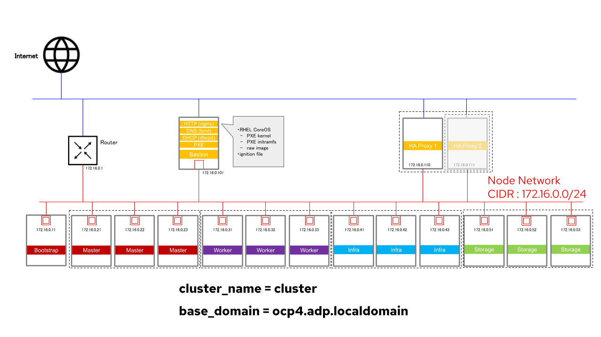

# 3章 : OpenShift Container Platform 4 Baremetal UPI の設計

## 3.3 ネットワーク構成
### 3.3.1. クラスター名とベースドメイン
<b>
cluster_name = cluster
 
base_domain = ocp4.adp.localdomain
</b>

 

- OpenShift クラスターの名前とベースドメインは上記の通りとする。
- これらは "<cluster_name>.<base_domain>" の形でクラスター内ネットワークのドメイン名となるため、ユニークなものになるよう注意する。

 

### 3.3.2. ノード間のネットワーク
| ネットワーク | 本数 | CIDR | 帯域幅 1 | 備考 |
|:----------:|:----:|:---:|:----:|:----|
| Node Network | 1 | 172.16.0.0/24  | 10 Gbit |

*1 : 必要に応じて適宜Bondingなどで冗長化、帯域幅の拡張を行う。BMC用は必要に応じて適宜用意する。  

 
 

- OpenShift クラスターではノード間のネットワークは基本的に1本である。 
※ [Multus](https://docs.openshift.com/container-platform/4.5/networking/multiple_networks/understanding-multiple-networks.html) を利用すれば複数のネットワークを使う価値があるが、本構成では使用しないこととする。
- 全てのノード/サーバーからインターネットに通信できるよう、適宜外部にルーティングしておく。

 

### 3.3.3. 各ノード/サーバーのIPアドレスとhostname

| ノード/サーバー | IPアドレス | &emsp;&emsp;&emsp; | ノード/サーバー | IPアドレス |
|:-------------:|:---------:|:---------:|:-------------:|:---------:|
| Bootstrap Node| 172.16.0.11 || Storage Node 1 | 172.16.0.51 |
| Master Node 1 | 172.16.0.21 || Storage Node 2 | 172.16.0.52 |
| Master Node 2 | 172.16.0.22 || Storage Node 3 | 172.16.0.53 |
| Master Node 3 | 172.16.0.23 ||||
| Worker Node 1 | 172.16.0.31 || Bastion        | 172.16.0.101 |
| Worker Node 2 | 172.16.0.32 || Load Balancer 1| 172.16.0.110 |
| Worker Node 3 | 172.16.0.33 || Load Balancer 2| 172.16.0.111 |
| Infra Node 1  | 172.16.0.41 ||||
| Infra Node 2  | 172.16.0.42 || Router         | 172.16.0.1 |
| Infra Node 3  | 172.16.0.43 ||||

 

### 3.3.3. 利用するポート

 
 

- OpenShift クラスターではノード間のネットワークは基本的に1本である。 

### 3.3.4. OpenShift クラスターのネットワーク
| ネットワーク | 本数 | CIDR | 帯域幅 | 備考 |
|:----------:|:----:|:---:|:----:|:----|
| Cluster Network | 1 | 10.128.0.0/14  | - |
| Service Network | 1 | 172.30.0.0/16  | - |

 
 

- OpenShift クラスター内部では **Cluster Network** と **Service Network** が必要となる。
- これらのネットワークは、クラスター構築時に Cluster Network Operator によって自動で構成される OpenShift SDN によって提供される、オーバーレイネットワークである。 
そのため構築時にあらかじめ用意する必要はなく、OpenShift インストール時に使用する install-config.yaml ファイルで指定するだけで良い。

 

## → Next: [3.4. ストレージ構成](./3.4.md)
