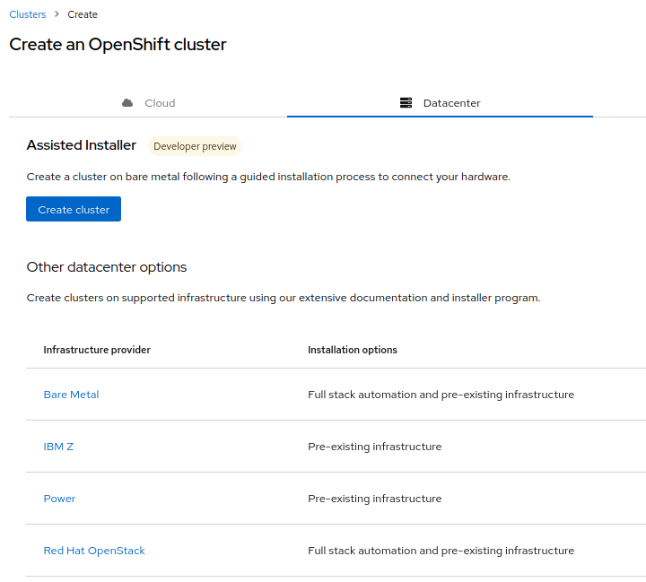
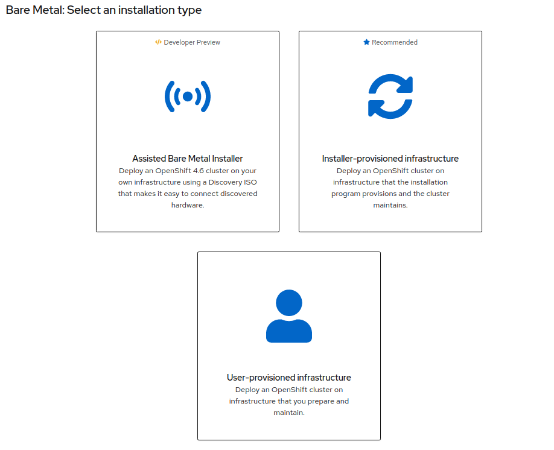

# 4-3. OpenShiftのCLIコマンドとインストーラーを手に入れる

インストール・プログラムを配布している[cloud.redhat.com](https://cloud.redhat.com/openshift/create)にアクセスします。(Red Hatのアカウントが必要です)

ここで `Datacenter` のタブから `Bare Metal` を選びます。



続いて `User-provisioned infrastructure` を選びます。



次のページで①にリストされている以下のものを、`踏み台サーバー`上にダウンロードします。合計で3つのファイルがあります。
- OpenShift installer (ここでは Linux を選択)
- Pull Secret
- Command line interface (ここでは Linux を選択)


以下もダウンロードできるようになっていますが、既にセクション[「4-2-3. RHEL CoreOSのインストールイメージを入手する」](2.iPXE環境の作成.md)で準備しているので必要ありません。
- ISOイメージ / RAW イメージ 

ファイルは、セクション[「4-1. 踏み台サーバーをセットアップする」](1.踏み台サーバーをセットアップする.md)で作成した `/root/openshift`にダウンロードする事にします。

ダウロードしたものを解凍、必要無くなった`tar.gz`を削除すると以下のように見えるはずです。

```
$pwd
/root/openshift/
$ ls -ltr
total 490340
-rwxr-xr-x. 2 root root  74528344 Jan 16 19:46 oc        # OpenShift の CLI コマンド
-rwxr-xr-x. 2 root root  74528344 Jan 16 19:46 kubectl
-rwxr-xr-x. 1 root root 353038336 Jan 16 11:23 openshift-install　　 # OpenShift のインストーラーコマンド
-rw-r--r--. 1 root root       706 Jan 16 11:23 README.md
-rw-r--r--. 1 root root      2759 Feb  1 14:33 pull-secret.txt
```

`oc` コマンドと `kubectl` コマンドがパス無しで実行できるように `PATH` 変数に展開場所を追加しておきます。

```
$ export=$PATH:/root/openshift/           # <ocコマンドとkubectlのファイルの場所>
$ oc version                              # PATHが通って oc コマンドが実行できる事を念のため確認
Client Version: 4.6.13
$
```

---

## → Next: [4-4. インストールに必要な設定ファイルを作成する](4.installに必要な設定ファイルを作成する.md)